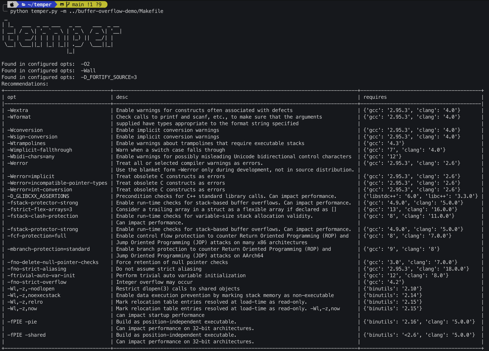

# Temper
Compiler Hardening for C/C++ based on the [OpenSSF Compiler Hardening Guide](https://best.openssf.org/Compiler-Hardening-Guides/Compiler-Options-Hardening-Guide-for-C-and-C++.html)


## Usage
Run this in your build environment, otherwise might give inaccurate results due to compiler being different than the one used in production
```sh
python3 temper.py --makefile <path-to-project-makefile>
```

## Options
```sh
 _
| |_   ___  _ __ ___   _ __    ___  _ __
| __| / _ \| '_ ` _ \ | '_ \  / _ \| '__|
| |_ |  __/| | | | | || |_) ||  __/| |
 \__| \___||_| |_| |_|| .__/  \___||_|
                      |_|

usage: temper.py [-h] [-m MAKEFILE] [-i INPUT_JSON_PATH] [-o] [--apply] [-l] [-d] [--show]

Temper: Harden your C/C++ projects - Analyse and find secure compiler options for your makefile

options:
  -h, --help            show this help message and exit
  -m MAKEFILE, --makefile MAKEFILE
                        Path to Makefile to analyse and get recommendations
  -i INPUT_JSON_PATH, --input-json-path INPUT_JSON_PATH
                        Path to input json generated from tool to get recommendations
  -o, --output          Store analysed options in json output file
  --apply               Apply recommended options to Makefile
  -l, --list            List compiler options in OpenSSF database
  -d, --debug           Debug mode
  --show                Show configured options in Makefile
```

## Example


## Extra
- Database Updater Scraper: extra/scraper.py
    + Fetches OpenSSF Compiler Options HTML page
    + Extracts all tables using BeautifulSoup4
    + Extracted the relevant tables for recommended compiler options to create db.json file
